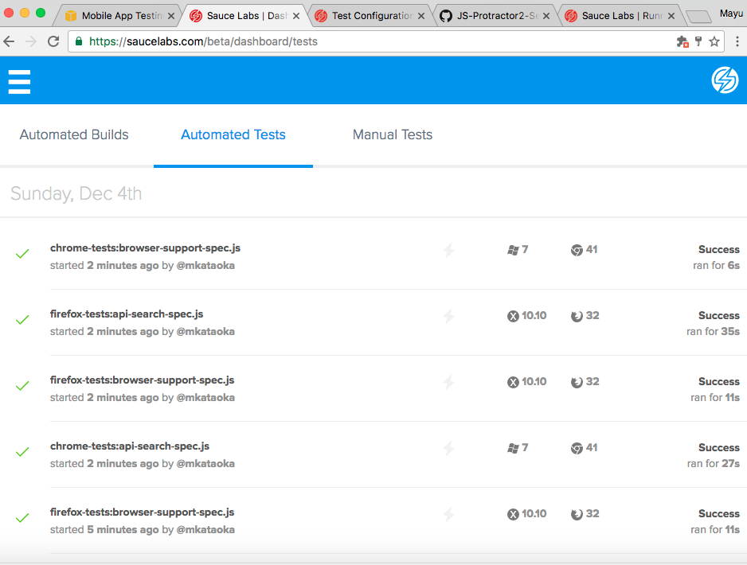

## protractor-demo

Created a sample test with Protractor+Jasmine+Javascript.

## Tools used in the code

- Saucelabs (to run the tests against different browsers)
- Applitool (for UI visual diff)
- Gulp (a task manager for easy test execution)
- Page Objects (to write reusable and maintainable code)
- Data Provider (to run a same test with different values)
- Allure report

## How to run a smoke test

    npm install

    node_modules/gulp/bin/gulp.js smoke

## How to run a regression test

    npm install

    node_modules/gulp/bin/gulp.js regression

## How to configure the tests to run on Saucelab

- Add the following in your bash_profile

    export SAUCE_USERNAME= Your Sauce User Name

    export SAUCE_ACCESS_KEY= Your Sauce Access key

- Please look at my Sauce Labs configs in https://github.com/mayukataoka/protractor-demo/blob/master/conf.js

## Here is the multi browser test result shown on Saucelabs dashboard.

